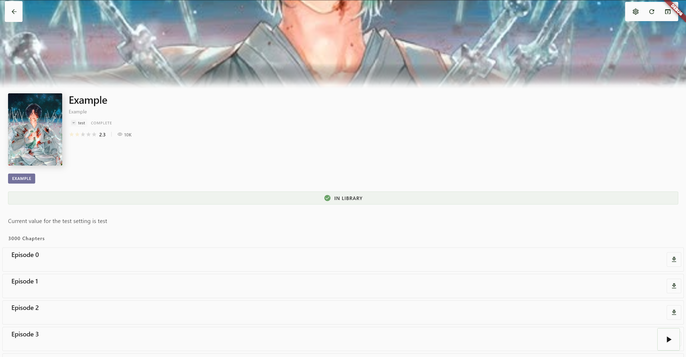
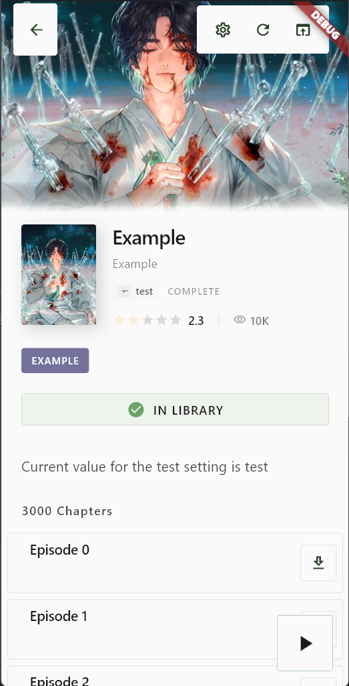
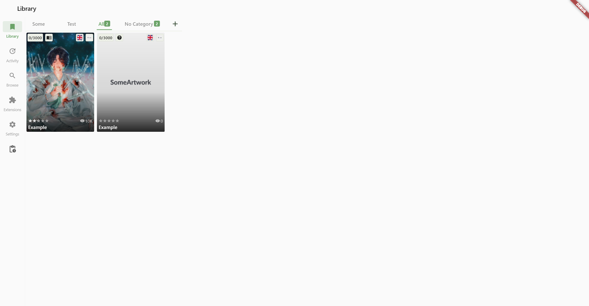
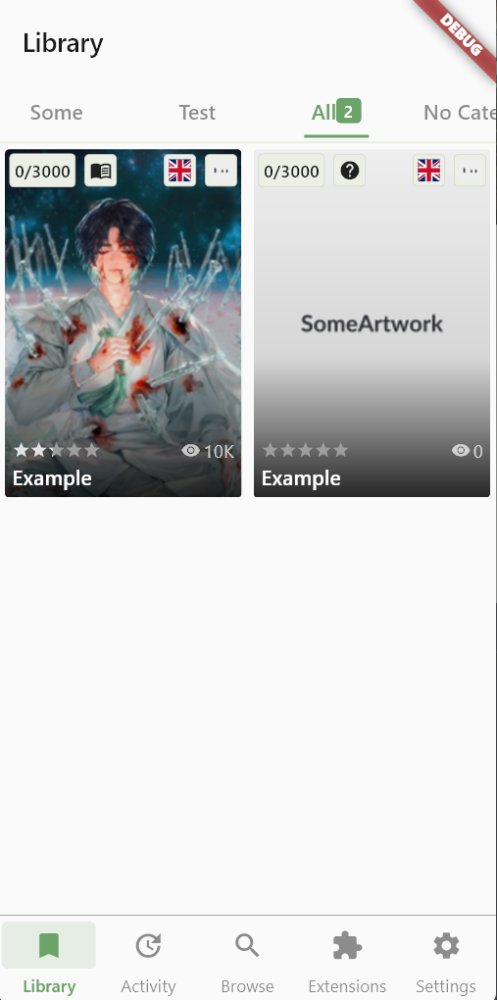
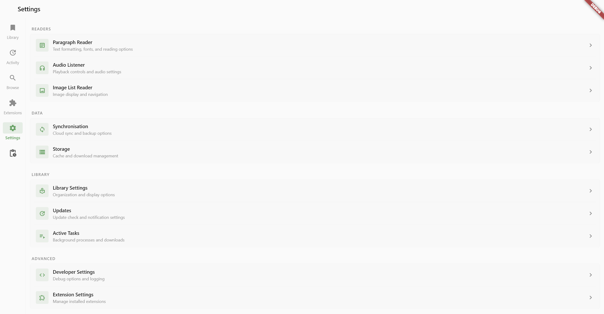
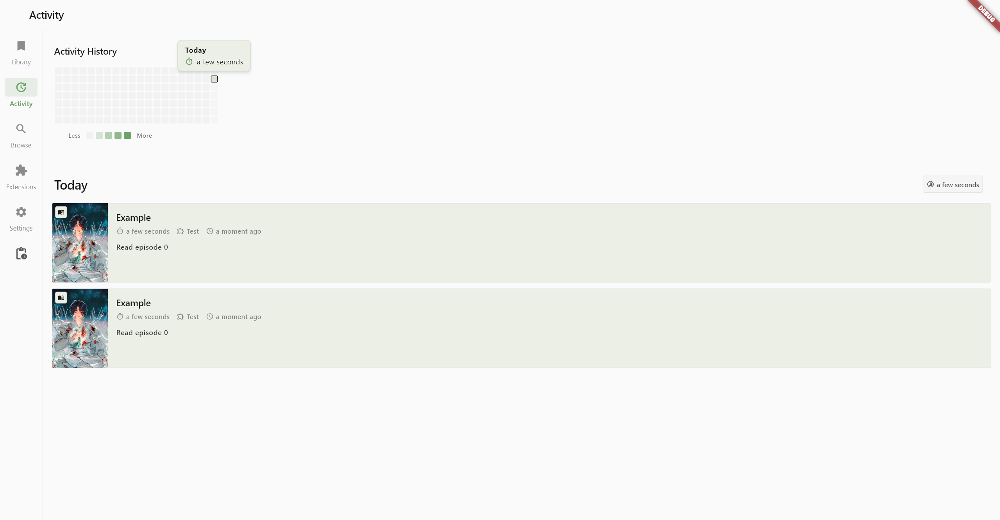

<h1> dion</h1>

<!-- Things TODO -->
<!---->

 

An extensible Media Reader for all kind of media.

## Features
- Library Sync
- Downloads
- Categories
- Media
  - Novel
  - Comic/Manga
  - Video
  - Audio

## Architecture

An overview of the architecture can be found [here](ARCHITECTURE.md).

## Screenshots

  

  

  

  

  

  

<!--
## Install

- **Android**: Download the latest APK from the [GitHub Releases](https://github.com/bldng1337/dion/releases) page.
- **Windows**: Download the installer from [GitHub Releases](https://github.com/bldng1337/dion/releases) and run it.
- **Other platforms**: Currently not supported. For Linux I haven't done it yet and for IOS/MacOS I don't have a device to test it on.

## Contributing

See [CONTRIBUTING.md](CONTRIBUTING.md).

 TODO: contrib.rocks -->
